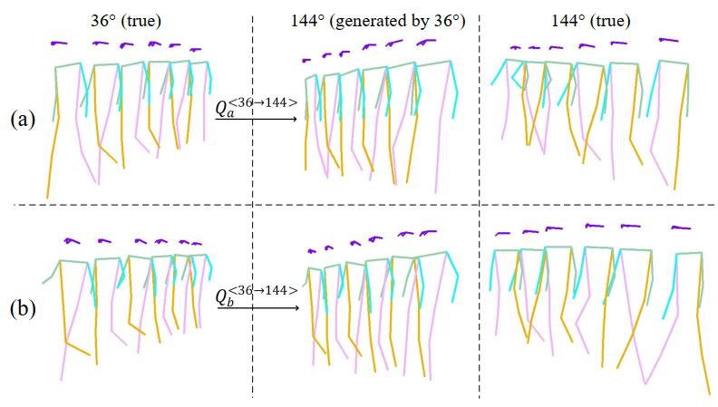
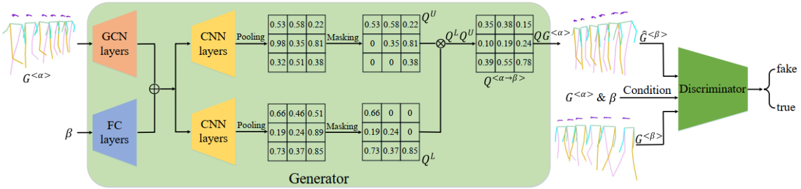

# LUGAN
Lower-Upper Generative Adversarial Network, a geometry-based multi-view pose generation pipeline.

 Manuscript __"Towards Complete-View and High-Level Pose-based Gait Recognition"__ is accepted by *IEEE Transactions on Information Forensics and Security*. Pleasr refer to https://arxiv.org/abs/2209.11577.

As can be seen, by column 1 and column 3, the cross-view intra-class variance is much larger than inter-class variance under the same view. To this end, we propose to generate multi-view pose sequences for each single-view pose sample. The cross-view pose generation is achieved by learning a linear transformation matrices $Q$, which exploits the spatial geometric relationship between cross-view poses.

The framework of LUGAN

1. Prepare data followed by https://github.com/tteepe/GaitGraph;
2. Run train.py

